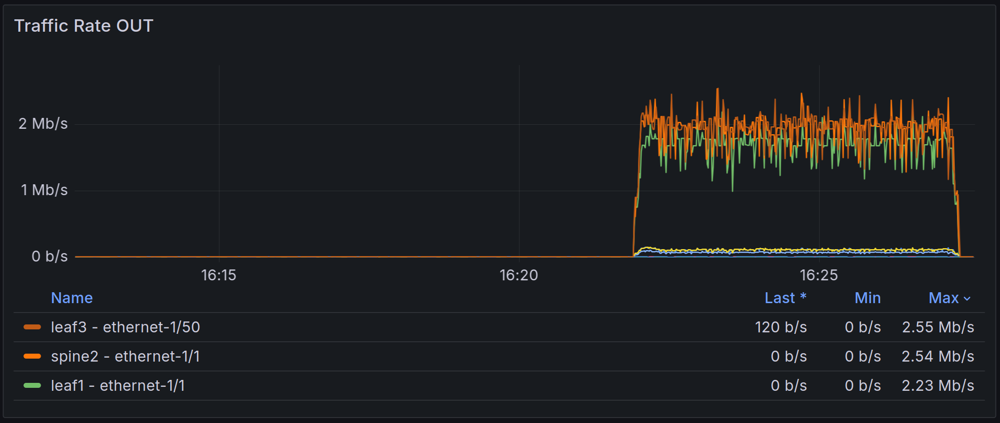

# Streaming Telemetry Demo Lab

Purpose of this lab is to demonstrate capabilities of Streaming Telemetry. 

In this lab there is a small network of Nokia SR Linux switches (because they are publicly available for lab use). Switches send continous stream of telemetry data to [gnmic](https://gnmic.openconfig.net/) which is gnmi collector. gnmic pushes data to InfluxDB. Grafana queries data from InfluxDB and visualizes it to dashboards.

Everything in this lab is powered by [containerlab](https://containerlab.dev/).

> Note: This lab is greatly inspired by [Nokia SR Linux Streaming Telemetry Lab](https://github.com/srl-labs/srl-telemetry-lab) and uses their images for clients and devcontainer. Network part is mostly copied from there. Telemetry stack sligtly differs.

## Lab topology


This lab consist of five switches, three linux clients and telemetry components gNMIc, InfluxDB and Grafana. Green management network which is shown in the diagram provides connectivity between all nodes. White links form datapath between clients and switches.

Note: it is not mandatory to run this lab in Codespaces. You can run this lab on any machine which has containerlab installed.


## Telemetry dashboards

<table style="border: none;">
  <tr>
    <td></td>
    <td></td>
  </tr>
  <tr>
    <td></td>
    <td></td>
  </tr>
  <tr>
    <td></td>
    <td></td>
  </tr>
</table>


## Starting the lab

<div align=center markdown>
<a href="https://codespaces.new/JaakkoRautanen/telemetry-demo?quickstart=1">
</a>

**[Run](https://codespaces.new/JaakkoRautanen/telemetry-demo?quickstart=1) this lab in GitHub Codespaces for free**.  
[Learn more](https://containerlab.dev/manual/codespaces) about Containerlab for Codespaces.  
<small>Machine type: 4 vCPU · 8 GB RAM</small>
</div>

This lab can be run completely on Github Codespaces:

1. Click [Run In Codespaces](https://codespaces.new/JaakkoRautanen/telemetry-demo?quickstart=1)
2. Start containerlab by typing ```sudo clab deploy``` to terminal which opened in VScode inside browser (or deploy from containerlab VScode extension menu)

## Stopping lab

Press `Ctrl` + `Shift` + `P` to open command palette in VScode and select `Codespaces: Stop codespace`. After that lab is stopped and doesn't consume your Codespaces quota.

If you just want to stop container lab type ```sudo clab destroy```

## Usefull information

| System                | Username/password     |
|-----------------------|-----------------------|
| Grafana               | grafana/grafana       |
| InfluxDB              | influx/influxinflux   |
| SR-Linux Switches     | admin/NokiaSrl1!      |

### Traffic generation

You can use following commands to ask clients to send some traffic:
- `bash traffic.sh start all` - start traffic between all nodes
- `bash traffic.sh start 1-2` - start traffic between client1 and client2
- `bash traffic.sh start 1-3` - start traffic between client1 and client3
  
To stop the traffic:

- `bash traffic.sh stop` - stop traffic generation between all nodes
- `bash traffic.sh stop 1-2` - stop traffic generation between client1 and client2
- `bash traffic.sh stop 1-3` - stop traffic generation between client1 and client3